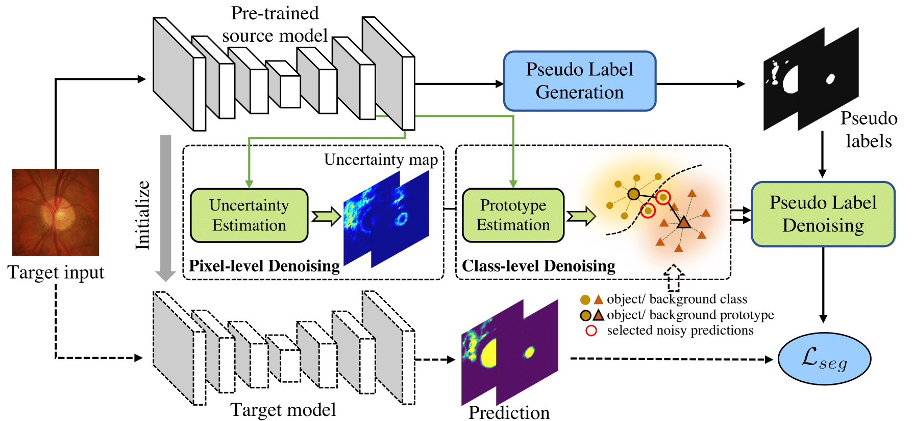

# Source-Free Domain Adaptive Fundus Image Segmentation with Denoised Pseudo-Labeling

Pytorch implementation of our source-free unsupervised domain adaptation method with denoised pseudo-labeling. <br/>

## Paper
[Source-Free Domain Adaptive Fundus Image Segmentation with Denoised Pseudo-Labeling] MICCAI 2021
<p align="center">
  
</p>

## Installation
* Install Pytorch 0.4.1 and CUDA 9.0
* Clone this repo
```
git clone https://github.com/cchen-cc/SFDA-DPL
cd SFDA-DPL
```

## Train
* Download datasets from this [link](https://drive.google.com/file/d/1B7ArHRBjt2Dx29a3A6X_lGhD0vDVr3sy/view)
* Download source domain model from this [link](https://www.dropbox.com/s/qygkmpm6ez6bojd/source_model.pth.tar?dl=0) or specify the data path in `./train_source.py` and then train `./train_source.py`.
* Save source domain model into folder `./logs/source`.
* Download generated pseudo labels from this [link](https://www.dropbox.com/s/opuz9pt78ng1yds/pseudolabel.zip?dl=0) or specify the model path and data path in `./generate_pseudo.py` and then train `./generate_pseudo.py`.
* Save generated pseudo labels into folder `./generate_pseudo`.
* Run `./train_target.py` to start the target domain training process.


## Note
* Contact: Cheng Chen (chencheng236@gmail.com)
